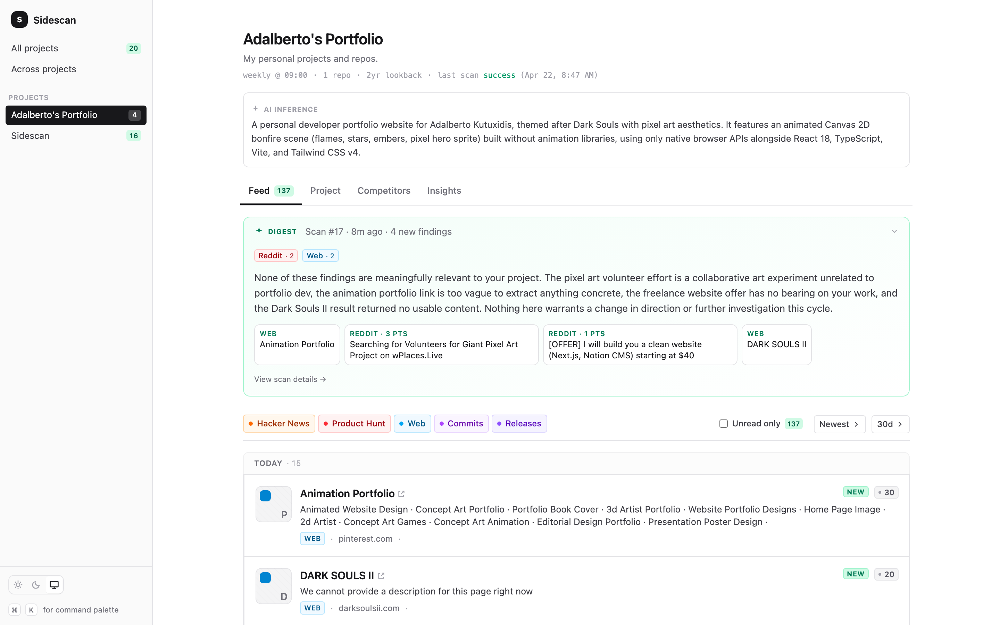

# Sidescan

> Sidescan watches the world around your GitHub repos — HN, Reddit, Dev.to, competitors — and tells you what you might be missing.



Self-hosted. Single Docker image. Zero telemetry. MIT.

## Why

You're a solo dev shipping a product. Somewhere on Hacker News this week, two teams you've never heard of are building something adjacent to yours. On Reddit, people are discussing a problem your project already solves. A competitor just tagged a release with a feature you don't have.

You can't scroll all of that. Sidescan does — on a schedule, for every project you point it at. It reads your repo to figure out what you're building, fans out to HN, Reddit, Lobsters, Dev.to, GitHub, and the web for anything near your space, and synthesizes the result into:

- **A daily/weekly feed** of everything new, grouped by day
- **A competitors view** of similar GitHub repos ranked by activity
- **An Insights tab** with AI-written bullets telling you what peers shipped recently and specific next-step suggestions grounded in your own commit history

## Quickstart (Docker)

Requires Docker + Docker Compose.

```bash
git clone https://github.com/frypizzabox/sidescan my-sidescan
cd my-sidescan

# 1. Config + API keys
cp packages/server/src/config/example.yaml config.yaml
cat > .env <<'EOF'
ANTHROPIC_API_KEY=sk-ant-...    # required
GITHUB_TOKEN=ghp_...            # required for private repos; recommended for rate limits
# BRAVE_API_KEY=...             # optional, enables web search
EOF

# 2. Edit config.yaml to add your projects
$EDITOR config.yaml

# 3. Boot
docker compose up -d

# 4. Open the dashboard
open http://localhost:3000

# 5. Trigger your first scan
docker compose exec sidescan node packages/server/bin/sidescan scan <your-project-slug> --bootstrap
```

An install is one directory holding `config.yaml`, `.env`, and `data/` (SQLite). Config is edited by hand; the web UI is view-only.

## Config shape

```yaml
providers:
  ai: claude              # claude | openai | ollama
  search: brave           # brave | serper | null

projects:
  - name: My Project
    slug: my-project
    bootstrap_lookback_years: 2
    scan:
      frequency: weekly   # daily | weekly | hourly | manual
      time: "09:00"
    repos:
      - path: https://github.com/owner/repo
      # Or a local clone:
      # - path: /Users/you/Projects/my-project
```

Full example: [`packages/server/src/config/example.yaml`](packages/server/src/config/example.yaml).

## Running from source (for contributors)

Requires Node ≥ 20.

```bash
git clone https://github.com/frypizzabox/sidescan my-sidescan
cd my-sidescan
npm install
npm run build
node packages/server/bin/sidescan init
# edit config.yaml + .env
node packages/server/bin/sidescan start
# In a second terminal for HMR dev UI:
npm run dev:web
```

CLI surface: `init`, `start`, `status`, `reload`, `scan [--all] [--bootstrap]`, `reset`, `version`.

## Costs

A scan makes ~3–4 AI calls (repo inference, ranker, what's-new digest, insights) plus source requests.

- Claude Sonnet 4.6: ~$0.03–0.08 per scan
- HN / Reddit / Lobsters / Dev.to / GitHub (unauth): free
- Brave free tier: 1 req/sec, 2k/month · Serper: pay-per-search

A weekly scan across 5 projects is roughly $2–5/month.

## Principles

- **Your data stays on your box.** Zero telemetry. The binary never phones home.
- **Config is the source of truth.** Edit `config.yaml` by hand. The UI shows findings; it does not mutate config.
- **BYO keys.** All API keys come from env vars — never `config.yaml` — so the config file is safe to commit to a dotfiles repo.
- **Cumulative, not destructive.** Findings accumulate across scans with `first_seen` / `last_seen` timestamps. `sidescan reset` is the only path to wipe.

## License

MIT.
